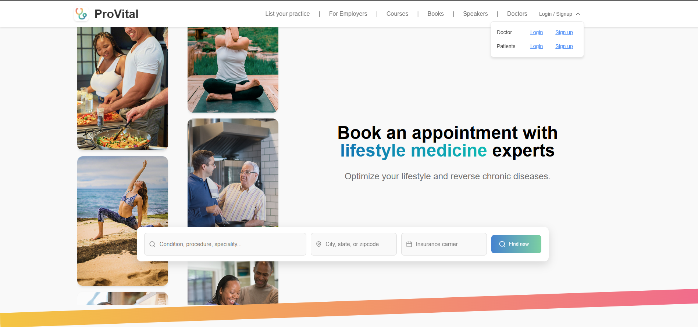
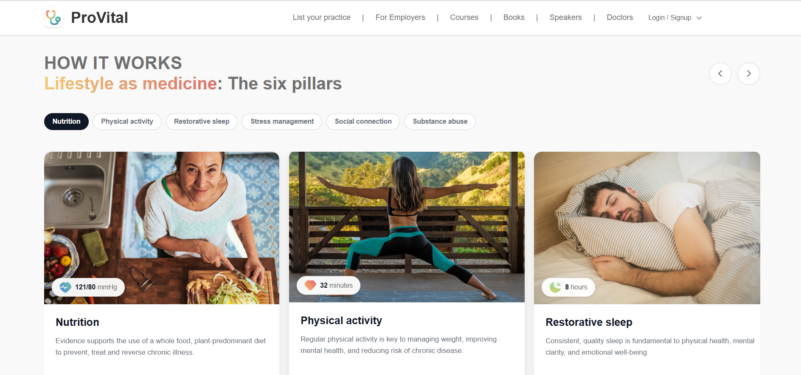
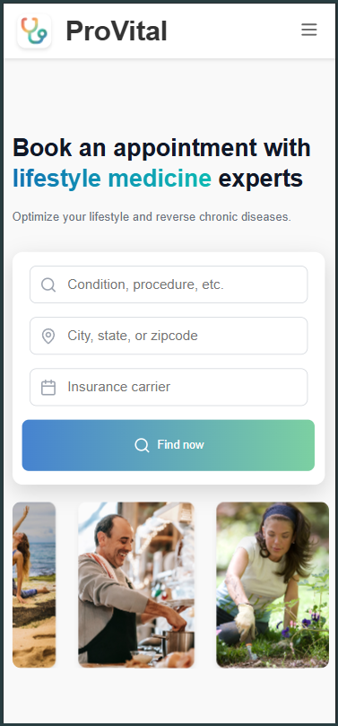
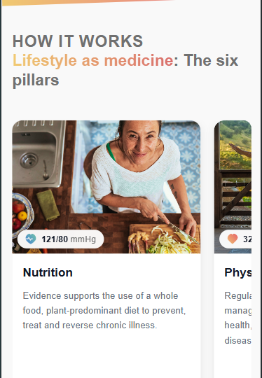
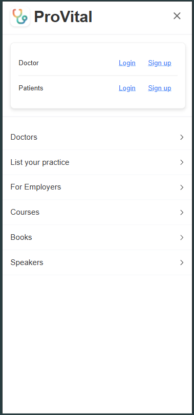

# 🏥 Healthcare Platform - Frontend Assignment

## 📋 Overview

This project demonstrates advanced web development proficiency by implementing a fully responsive **Healthcare Platform** using modern React, custom CSS, and smooth animations—all built without external CSS libraries.

---

## 🎯 Task Highlights

### ✅ Technology Stack

- **React 19.1.0** – Modern features and hooks
- **Vanilla CSS** – Fully customized styling
- **Vite** – Lightning-fast build tool
- **Responsive Design** – Mobile-first, cross-device compatibility

### ✅ Design Implementation

- 🎯 Pixel-perfect recreation of the provided design
- 💻 Desktop and 📱 mobile views fully responsive
- 🎨 Professional, healthcare-appropriate styling
- ⚡ Interactive and animated user interface

---

## 🖼️ Screenshots











---

## 🚀 Getting Started

### 📦 Prerequisites

- Node.js (v18+)
- npm or yarn

### 🔧 Installation

```bash
git clone https://github.com/Shantanu993/proactiverly-frontend-task
cd proactiverly-frontend-task
npm install
npm run dev
```

Open in your browser: `http://localhost:5173`

---

### 🏗️ Build for Production

```bash
npm run build        # Create production build
npm run preview      # Preview production build
```

---

## 📁 Project Structure

### Folder Summary

| Directory         | Purpose                            |
| ----------------- | ---------------------------------- |
| `src/components/` | Reusable UI components             |
| `src/Pages/`      | Page-level views (Home, Main)      |
| `src/assets/`     | Image assets structured by purpose |
| `src/styles/`     | Global styling and theme           |
| `public/`         | Static files                       |

## 🎭 Animation System

- 🔁 **Infinite Scroll Galleries** – Looping image scroll
- 🖱️ **Hover Effects** – Interactive feedback
- 📱 **Touch Gestures** – Swipeable carousels
- 🧲 **Smooth Transitions** – Transform-based

---

## 📱 Responsive Design

| Device Type | Breakpoints      | Features                             |
| ----------- | ---------------- | ------------------------------------ |
| Mobile      | `< 768px`        | Touch-friendly UI, collapsible menus |
| Tablet      | `768px - 1024px` | Hybrid layout experience             |
| Desktop     | `> 1024px`       | Full layout, hover interactions      |

---

## ✨ Key Features

### 🧭 Navigation

- Responsive header
- Hamburger menu on mobile
- Authentication dropdown (UI level)

### 🧱 Healthcare Content

- Six **pillars of lifestyle medicine**
- Tabbed, interactive carousel with icons & badges

---

## 📝 Code Quality

- 📚 **Clean Code**: Well-documented, readable
- 🧩 **Modular Architecture**: Reusable components
- 🎨 **CSS**: Organized, scalable, and minimal

---

## ✅ Completion Summary

| Requirement                   | Status |
| ----------------------------- | ------ |
| React Implementation          | ✅     |
| No External CSS Libraries     | ✅     |
| Responsive Design             | ✅     |
| Complex Animations (CSS only) | ✅     |
| Pixel-Perfect Design Fidelity | ✅     |
| Code Quality Standards Met    | ✅     |
| Accessibility Support         | ✅     |
| Performance Optimization      | ✅     |

## 🎉 Conclusion

This project reflects:

- 🚀 **Modern Development**: React, Vite, vanilla CSS
- 🎯 **Design Precision**: Pixel-perfect UI
- 🧠 **User Experience**: Responsive, interactive, accessible
- 🔧 **Optimized Code**: High-performance and clean architecture

> **Built with precision, passion, and attention to detail.** ✨
